# Integrated Web Solutions for Language Together

## Introduction

Dative, Inc. has been privileged to work with Language Together on a series of interconnected projects aimed at enhancing their digital presence and providing innovative language learning solutions. This documentation provides a comprehensive overview of these projects, detailing the objectives, technologies used, challenges encountered, and solutions implemented.

### Overview of Dative's Collaboration with Language Together

Language Together is a platform dedicated to making language learning achievable for children. They utilize a unique method called the Spot Color Immersion Method® to teach vocabulary, phrases, and cultural lingo through 10-reader sets.

Dative, Inc. is a web development company that specializes in creating and managing websites that are easy to use and deliver results. Our collaboration with Language Together involved three main projects: the Language Together Website Migration, the Language Together Flashcard App, and the langt.co URL Shortener.

These projects were not only significant in their individual capacities but also as a collective effort to enhance Language Together's digital presence and user experience. Our collaboration was marked by a shared vision for innovative, user-friendly solutions that would make language learning more accessible and enjoyable for children.

### Interrelationship Between the Projects

The three projects were tightly coupled, each one supporting and enhancing the others.

- The Language Together Website Migration involved moving their existing website to a new server and performing updates. This migration laid the groundwork for the other projects, providing a stable and updated platform from which to launch the Flashcard App and the URL Shortener.
- The Language Together Flashcard App was a new product offering from Language Together. The website's CMS was modified to support this app, allowing customers to navigate flashcards online and listen to audio files.
- The langt.co URL Shortener was added to support both the Flashcard App and the website. It helped Language Together create short, manageable URLs for their marketing efforts, improving user experience and tracking capabilities.

In the following sections, we will delve into each project in more detail, exploring the goals, technologies used, infrastructure and architecture, roles and responsibilities, project roadmap, challenges and solutions, and ongoing maintenance and updates.

## 1. Language Together Website Migration

[languagetogether.com](https://languagetogether.com)

### 1.1 Project Overview

The Language Together Website Migration was the first project we embarked on with Language Together. The primary goal was to provide continued support for their existing website and overcome their inability to update the website due to server and development limitations.

We were able to migrate their existing Craft CMS website from Bluehost to a server better suited to run Craft, and perform some minor updates to the website. This migration was crucial as it laid the groundwork for the subsequent projects.

### 1.2 Goals and Objectives

The main objective of the project was to enhance the performance and reliability of the Language Together website. This involved:

- Migrating the website to a new server that is better suited to run Craft CMS.
- Overcoming server and development limitations that were preventing updates to the website.
- Performing minor updates to the website after the migration.

### 1.3 Technologies Used

The project utilized the following technologies:

- Craft CMS 2.9.2
- PHP 7.4.11
- MySQL 5.7.32
- Nginx 1.18.0

The server hosting Language Together's website was provisioned and managed using Laravel Forge. It was set up on a Digital Ocean Droplet located in Region New York 1, with an IP address of 157.230.179.54. The server is running a LEMP stack on Ubuntu 20.04 (LTS) x64 as the operating system, and had 1 GB of Memory, 1 Intel CPU, and a 25 GB SSD as its hardware configuration. In terms of bandwidth, it has 1 TB Transfer per month.

### 1.4 Infrastructure and Architecture (with Diagram)

The infrastructure and architecture of the project involved a LEMP stack on a Digital Ocean Droplet. The server was provisioned and managed using Laravel Forge. The website was built using Craft CMS, which was hosted on the server.

### 1.5 Role and Responsibilities

As the primary developer for this project, Dative was responsible for:

- DevOps: Setting up and managing the server on Digital Ocean using Laravel Forge.
- Backend Development: Migrating the website and overcoming server and development limitations.
- Frontend Development: Performing minor updates to the website after the migration.
- Project Management: Coordinating the project and communicating with the client.

### 1.6 Project Roadmap

The project was divided into several stages:

- Initial Consultation: Understanding the client's needs and planning the migration.
- Setting Up the Server: Provisioning and managing the server using Laravel Forge.
- Migrating the Website: Transferring the website to the new server and overcoming server and development limitations.
- Testing / QA: Ensuring the website functions correctly on the new server.
- Finalizing Migration: Making the necessary DNS changes to point the domain to the new server.

### 1.7 Challenges and Solutions (with Context)

The main challenge was that the original Craft CMS website wasn't version controlled. We had to manually download the files and database from Bluehost, and then upload them to the new server. We also had to manually update the Craft CMS version to 2.9.2 as well as update the plugins.

The other challenge was that the website was using a custom plugin to manage the various content sections, instead of either built-in Craft CMS features or popular plugins. This made it difficult to migrate the content to the new server.

We overcame these challenges by creating a staging server to test the migration process, and then documenting the process so that we could repeat it on the production server.

Due to the lack on database migrations in Craft CMS 2, we've opt to update the update the production server directly using SSH instead of deploying changes using CI/CD.

### 1.8 Ongoing Maintenance and Updates

We are currently performing ongoing maintenance and updates on the website and the server. This includes regular updates to the Craft CMS and server software, as well as monitoring the server's performance and resolving any issues that arise.

Here's a diagram that illustrates the infrastructure and architecture of the Language Together Website Migration project:

### 1.9 Craft CMS Configuration

The Language Together website is built on Craft CMS, a flexible and powerful content management system. Here's an overview of the website's configuration:

#### 1.9.1 Craft CMS Version

The website is running on Craft CMS version 2.9.2. This version was chosen for its stability and compatibility with the website's existing plugins and content model. The client opted to not upgrade to Craft 3, and later to not upgrade to Craft 4 (the latest major version), due to the extensive changes required and potential impact on the website's functionality.

#### 1.9.2 Plugins

The website uses a number of plugins to extend the functionality of Craft CMS. These include:

- [Asset Rev](https://github.com/clubstudioltd/craft-asset-rev/tree/v5)
- [Element API](https://github.com/craftcms/element-api/tree/v1)
- [Formerly](https://github.com/enigmadigital/Formerly)
- [Linkit](https://github.com/fruitstudios/linkit)
- Menus (No longer available)
- Redactor Plugins (No longer available)
- [Retour](https://github.com/nystudio107/retour/tree/master)
- [SEOmatic](https://github.com/nystudio107/seomatic/)
- [SafeCraft](https://github.com/quebecstudio/safecraft)
- [Super Table](https://github.com/verbb/super-table/tree/craft-2)
- [Task Manager](https://github.com/boboldehampsink/taskmanager)
- Teacher Site Plugins (No longer available)
- XML Sitemap (No longer available)
- [User Creator](https://github.com/sjelfull/Craft-UserCreator)
- Zip Assets (No longer available)

#### 1.9.3 Content Model

The content model of the website is structured around various sections. These sections include:

- Home (Single): Showcases featured products, and testimonials, providing an engaging introduction to the site.
- About (Single): Presents comprehensive information about Language Together, detailing the company's history, mission, and values.
- Awards (Single): Highlights the accolades and recognition Language Together has received, underscoring its credibility and success.
- Contact (Single): Features a contact form, enabling visitors to easily get in touch with Language Together (Formerly).
- Method (Single): Explains Language Together's unique teaching method, offering insight into its pedagogical approach.
- Research (Single): Recommends valuable articles and books, serving as a resource for those interested in language learning research.
- Teachers (Single): Provides information about Language Together's offerings for teachers, detailing the benefits and features of its products.
- General Pages (Channel): Includes essential pages such as the privacy policy and terms of use, ensuring transparency and trust.
- Listen (Structure): Hosts language audio sets pages, where users can play and listen to audio files.
- Shop (Structure): Displays product pages, providing detailed information about Language Together's products and facilitating online purchases.

Each section is equipped with a unique set of fields, including text fields, rich text fields, and image fields, to facilitate content management and presentation.

To support the Flashcard App, we've integrated two new sections:

- Flashcard Themes (Channel): This section hosts flashcard themes, complete with cards, images, and audio files.
- Flashcard Sets (Channel): Features flashcard language and level sets, each linked to corresponding flashcard themes, offering a structured way to manage language sets.

#### 1.9.4 Assets

The website has several configured asset locations, each serving a specific type of content:

- Photos: This location stores images used across the website, such as those used in blog posts, product pages, and general site content.
- Products: This location is dedicated to images of Language Together's products, providing clear visuals for the Shop section.
- Audio: This location hosts audio files for the Listen and Flashcard Themes sections, offering users aural language learning content.
- Illustrations: This location stores illustrations used across the website, adding a visual element to the language learning experience.
- PDFs: This location contains PDF files, such as downloadable resources and guides.
- Guides: This location is specifically for guide-related assets, providing resources for users to better understand and use Language Together's products.
- Flashcard Assets: This location stores assets specifically for the Flashcard App, including images and audio files associated with flashcard themes and sets.

Each asset location is configured to ensure easy management and optimal performance of the website.

## 2. Language Together Flashcard App

[sunny.languagetogether.com](https://sunny.languagetogether.com/)

### 2.1 Project Overview

The Language Together Flashcard App was a project that emerged from Language Together's new flashcard product initiative. We developed a companion web app that allows customers to easily navigate the flashcards online and listen to the card audio files. This project was a significant step forward in Language Together's digital offerings, providing an interactive and engaging language learning tool for users.

### 2.2 Project Goals

The primary goal of the Flashcard App project was to create a digital companion to Language Together's physical flashcard product. The app was designed to enhance the user experience by providing easy navigation of flashcards and access to audio files. This digital extension of the product aimed to make language learning more accessible and engaging for users.

### 2.3 Technologies Used

The Flashcard App was developed using React, a popular JavaScript library for building user interfaces. We used create-react-app as a starting point, which provides a modern build setup with no configuration. The app was deployed to CloudFlare Pages, a fast, secure, and performant way to deploy and host JAMstack websites.

The content for the app comes from an API endpoint we added to the Craft CMS website. This allowed us to leverage the existing content management system and avoid the need for a separate backend for the app, as well as a familiar interface for the client to manage the app's content.

For error reporting, we used Sentry.io. This tool helps us monitor and fix crashes in real time, improving the app's reliability and user experience.

### 2.4 Dative's Role

As with the Website Migration project, Dative was responsible for the full spectrum of development for the Flashcard App. This included DevOps, backend, and frontend development. We also managed the project and communicated with the client. Additionally, we designed the user interface for the app, ensuring it was user-friendly and visually appealing.

### 2.5 Challenges and Solutions

The Flashcard App project presented a unique set of challenges. Initially, the project started as a proof of concept but evolved into a full-fledged product. This meant that we had to leverage the existing Craft CMS website to host the content for the app, instead of creating a separate backend. We overcame this challenge by creating a custom API endpoint to serve the content to the app. While this solution is serviceable for the current version of the app, it may require reevaluation as the app grows.

The app was also originally meant to be mobile-only, but the client later decided to make it responsive. This change required us to redesign the UI to work on different screen sizes and it added additional cross-browser compatibility requirements. Despite this challenge, we were able to deliver a responsive app that provides a consistent user experience across different devices.

### Ongoing Maintenance and Updates

We are currently performing ongoing maintenance and updates on the Flashcard App. This includes regular updates to the React codebase, monitoring and resolving any issues reported by Sentry.io, and implementing new features as requested by the client.

Here's a diagram that illustrates the infrastructure and architecture of the Language Together Flashcard App project:

## 3. langt.co (URL Shortener)

### 3.1 Project Overview

The langt.co URL Shortener was a small project we undertook to help Language Together create short URLs for their marketing efforts. This tool allows Language Together to create concise and memorable URLs that redirect to specific pages on their website, improving the user experience and enhancing their marketing campaigns.

### 3.2 Project Goals

The primary goal of the langt.co URL Shortener project was to provide Language Together with a simple and effective tool for creating short URLs. These URLs are used in various marketing materials, making it easier for users to visit specific pages on the Language Together website.

### 3.3 Technologies Used

The server hosting the langt.co URL Shortener is provisioned and managed using Laravel Forge. The redirects are managed using the Laravel Forge Redirects feature, which is a wrapper around the Nginx Redirects feature. We update the redirects by running a local Python script that uses the Forge API.

### 3.4 Dative's Role

Dative was responsible for setting up and managing the langt.co URL Shortener. This included server provisioning, setting up the redirects, and creating the Python script for updating the redirects.

### 3.5 Challenges and Solutions

The langt.co URL Shortener project was relatively straightforward. The only challenge we faced was the time it took for the client to decide on the domain name. Once the domain name was decided, we were able to quickly set up the URL shortener.

### 3.6 Ongoing Maintenance and Updates

We are not currently performing any ongoing maintenance or updates on the langt.co URL Shortener project. However, we are always ready to assist Language Together if they need any changes or updates to the URL shortener.

Here's a diagram that illustrates the infrastructure and architecture of the langt.co URL Shortener project:

## 4. Relationship Between the Projects

The three projects - Language Together Website Migration, Language Together Flashcard App, and langt.co URL Shortener - are tightly coupled and support each other in various ways.

### 4.1 Website Migration and Flashcard App

The Website Migration project laid the groundwork for the Flashcard App. The migration to a more robust server and the updates to the Craft CMS website allowed us to leverage the existing content management system for the Flashcard App. We added a custom API endpoint to the Craft CMS website to serve content to the app, delaying the need for a separate backend for the app. This integration allowed us to create a familiar experience for Language Together's team, who can now update the content for the app with ease.

### 4.2 Website Migration and URL Shortener

The Website Migration project also facilitated the creation of the langt.co URL Shortener. With the website hosted on a server managed by Laravel Forge, we were able to use the Laravel Forge Redirects feature to manage the redirects for the URL shortener. This allowed us to create a tool that enhances Language Together's marketing efforts by providing short and memorable URLs.

### 4.3 Flashcard App and URL Shortener

The Flashcard App and the URL Shortener also support each other. The URL Shortener can be used to create short URLs that redirect to specific flashcards in the app, making it easier for users to access specific content. This integration enhances the user experience and supports Language Together's marketing efforts.

In conclusion, these three projects, while distinct, are interconnected and mutually supportive, creating a comprehensive digital ecosystem for Language Together.

## 5. Project Roadmap

As Dative's collaboration with Language Together transitions, the focus remains on ensuring a smooth handover and continued success of the projects. Here's an overview of the roadmap:

### 5.1 Language Together Website

The ongoing maintenance and updates for the Language Together website will continue. This includes regular updates to the Craft CMS, plugins, and server, as well as implementing minor features as requested by the client. We are also assisting the client in exploring the possibility of converting the website into a Shopify store and migrating the Flashcard App content to a separate backend.

### 5.2 Language Together Flashcard App

We are currently performing ongoing maintenance and updates on the Flashcard App. This includes regular updates to the React codebase, monitoring and resolving any issues reported by Sentry.io, and implementing minor new features as requested by the client. We are also preparing to clone the existing app for a new Flashcard Language Set.

### 5.3 langt.co URL Shortener

While there are no current plans for updates or maintenance on the langt.co URL Shortener, we are always ready to assist Language Together if they need any changes or updates to the URL shortener. Ideally, we would like to migrate the URL shortener to a separate server and add a user interface so the client can manage the redirects themselves.

As Dative phases out its relationship with Language Together, the goal is to ensure a smooth transition that supports Language Together's growth. As Language Together expands its offerings, they will benefit from an agency with more availability and resources to better service their needs.

## 6. Conclusion

Our collaboration with Language Together has been a rewarding journey. We've worked on three interconnected projects - the Language Together Website Migration, the Language Together Flashcard App, and the langt.co URL Shortener - each with its own unique challenges and solutions.

Throughout these projects, we've focused on delivering high-quality solutions that meet Language Together's needs. We've leveraged a range of technologies, from Craft CMS and PHP for the website migration, to React for the Flashcard App, and Laravel Forge for the URL shortener.

As we transition our relationship with Language Together, we are committed to ensuring a smooth handover. We are proud of the work we've done together and are confident that the projects we've worked on will continue to support Language Together's mission of making language learning fun and accessible.
